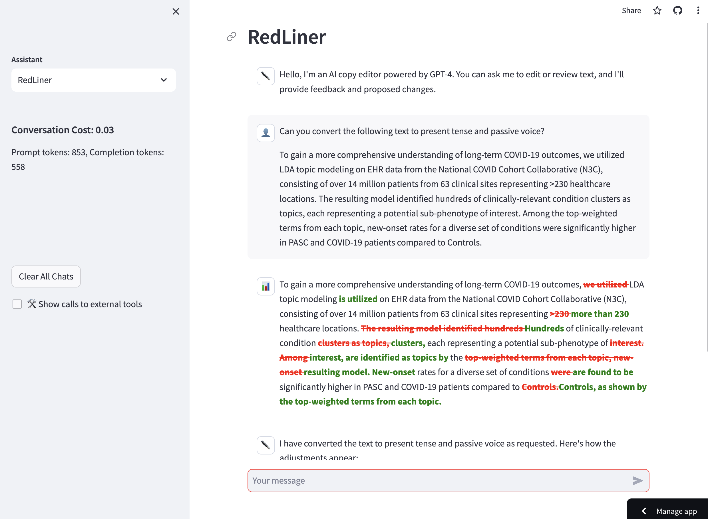

<!-- display screenshot.png -->


# RedLiner

A simple AI-driven copy editor.

## Run locally

You'll need [Poetry](https://python-poetry.org/).

Clone the repo:

```
git clone https://github.com/oneilsh/redliner
```

Install dependencies:

```
make install
```

Add your OPENAI_API_KEY environment variable to `.env`:

```
OPENAI_API_KEY=your-api-key
```

Start the server:

```
make app
```

Visit `http://localhost:8501` in your browser.

## Technologies

- [Kani](https://github.com/zhudotexe/kani)
- [KaniUtils](https://github.com/oneilsh/kani-utils)
- [Redlines](https://github.com/houfu/redlines)
- [StreamLit](https://streamlit.io/)